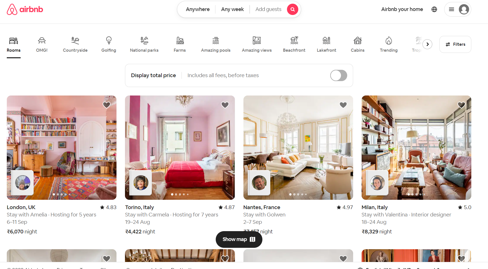
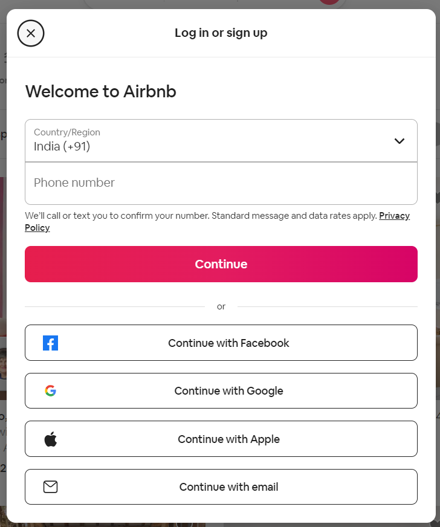

# Airbnb Clone

This is a clone of popular website [airbnb](#https://www.airbnb.co.in/)


 

## ScreenShots



## Table of Contents

## Introduction

Welcome to my Airbnb clone project! This project aims to replicate the core features of the Airbnb website, allowing users to browse and book accommodations. Users can also create and list their own hotels, manage reservations, and more.

Airbnb if of the most popular website which has beautiful UI/UX be it their 
1. Carousels 
2. Hover Effects
3. Models 
4. Transitions and animations
5. Filtering UI based of users choice of hotels 
6. Icons , Calenders , beautiful buttons

## Features

### Authentication

The project includes the following authentication options:

- Google Sign-In: Users can log in using their Google accounts.
- GitHub Sign-In: Users can log in using their GitHub accounts.
- Email Sign-Up and Sign-In: Users can sign up and log in using their email addresses.

### Create Your Own Hotel

Logged-in users have the ability to create and list their own hotels:

1. Log in to your account.
2. Click the "Airbnb Your Home" button.
3. Follow the steps to provide details about your hotel, such as location, description, photos, and pricing.
4. Your hotel will be listed and available for other users to book.

### Hotel Reservation

Logged-in users can reserve hotels by choosing dates from a calendar. Multiple reservations on the same dates are prevented.

### Image Upload

Users can upload images for their hotels to showcase them to potential guests.

### Trips

Users can view all their upcoming reservations on the by clickng on My Trips on which is seen by clicking on top right corner of the page.

### Cancel Reservations

Hotel creators can cancel guest reservations  by clickng on My reservations which is seen by clicking on top right corner of the page.

### Favorites

Users can like specific hotels and view their liked hotels on My Favourites which is seen by clicking on top right corner of the page.

### Logout

Users can log out of their accounts.

### Filtering

Users can filter hotels by country, Category, dates, price and based on rooms available .

## Getting Started

Follow these steps to get the project up and running on your local machine:

### Project setup
Clone the repository:
```
git clone https://github.com/Navadeepreddy16/test.git
```

 Navigate to the project directory: 
 ```
 cd airbnb-clone
 ```

- Install dependencies: `npm install` or `yarn install`
- Set up environment variables for authentication (see [Configuration](#configuration))
- Run the application: `npm start` or `yarn start`
- Open your web browser and navigate to `http://localhost:3000`

## Usage

Once the application is running, you can:

- Browse available accommodations
- View accommodation details, photos, and reviews
- Log in using your Google, GitHub, or email account
- Create and list your own hotels
- Reserve hotels by choosing dates
- Upload images for your hotels
- View upcoming reservations
- Cancel guest reservations for your own hotels
- Like and view your liked hotels
- Log out of your account
- Filter hotels by various criteria


### Environment Variables 
in .env file fill the below environment variable
- NEXT_PUBLIC_CLOUDINARY_API_KEY=< your api secret>
- CLOUDINARY_API_SECRET=< your cloudinary secret>